# Cookie Shop Specification
<!--[Present the project specification]-->
The Cookie Shop represents an online shop of cookies, where customers will be able to create an account and to view, buy, and rate cookies. They will also get a live notification when their favourite cookies are back on stock. The application is coded in Java and Java FX.

User Authentification - create account and login (for both a regular user and the administrator)
The regular user will be able to:
- search the cookies by the following properties: type, price, quantity of sweeteners and rating
- add multiple cookies in multiple quantities in the cart at the time of buying (also to buy them)
- add or remove any cookies from their favourite list
- rate the cookies (1-5 stars) only once and also to comment their opinion about the specific cookies
- get a live notification when their favourite cookie is back on stock
- see others' ratings on cookies and thumbs up/down whether they think the comments from the rating are useful or not (visible for anyone)

The administrator will be able to:
-CRUD on cookies
-CRUD on regular users' information
-generate two types of report files - one in pdf format and one in txt format, with the cookies bought in the last X days ( he can select the days). The reports will be in a user-selected location.
edit the users' ratings
-update the stock of the cookies 

Also, use:
- the Mockito framework
- the MVC architectural pattern
- the Factory Method design pattern

# Elaboration – Iteration 1.1

## Domain Model
<!--[Define the domain model and create the conceptual class diagrams]-->
Domain model

An object model of the domain that incorporates both behavior and data.

A Domain Model creates a web of interconnected objects, where each object represents some meaningful individual, whether as large as a corporation or as small as a single line on an order form. 
Putting a Domain Model in an application involves inserting a whole layer of objects that model the business area you’re working in. You’ll find objects that mimic the data in the business and objects that capture the rules the business uses. Mostly the data and process are combined to cluster the processes close to the data they work with. An OO domain model will often look similar to a database model, yet it will still have a lot of differences. A Domain Model mingles data and process, has multivalued attributes and a complex web of associations, and uses inheritance.

A simple Domain Model looks very much like the database design with mostly one domain object for each database table. A rich Domain Model can look different from the database design, with inheritance, strategies, and other [Gang of Four] patterns, and complex webs of small interconnected objects. A rich Domain Model is better for more complex logic, but is harder to map to the database. A simple Domain Model can use Active Record, whereas a rich Domain Model requires Data Mapper. 

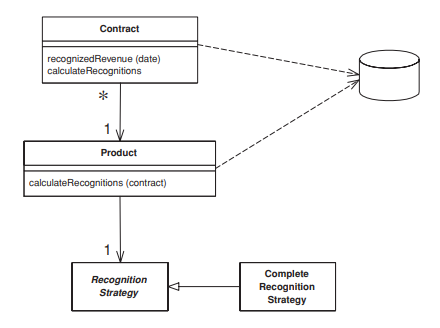

Conceptual Class Diagram

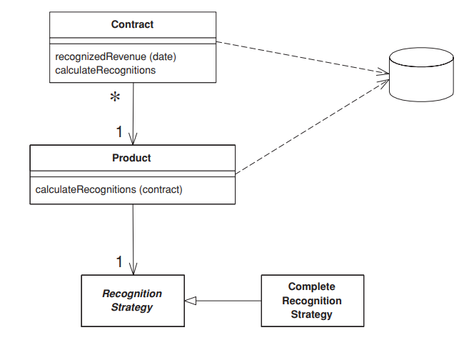

## Architectural Design

### Conceptual Architecture
<!--[Define the system’s conceptual architecture; use an architectural style and pattern - highlight its use and motivate your choice.]-->
The system's conceptual architecture will be composed of client-server.

Model-View-Controller
Splits user interface interaction into three distinct roles : model, view and controller.

MVC considers three roles. The model is an object that represents some information about the domain. It’s a non-visual object containing all the data and behavior other than that used for the UI. In its most pure OO form the model is an object within a Domain Model.

The view represents the display of the model in the UI. The view is only about display of information; any changes to the information are handled by the third member of the MVC trinity: the controller. The controller takes user input, manipulates the model, and causes the view to update appropriately. In this way UI is a combination of the view and the controller.

There are two principal separations: separating the presentation from the model and separating the controller from the view. Of these the separation of presentation from model is one of the most fundamental heuristics of good software design. This separation is important for several reasons. 

- Fundamentally presentation and model are about different concerns. When you’re developing a view you’re thinking about the mechanisms of UI and how to lay out a good user interface. 
- Depending on context, users want to see the same basic model information in different ways. Separating presentation and view allows you to develop multiple presentations—indeed, entirely different interfaces—and yet use the same model code.
- Nonvisual objects are usually easier to test than visual ones. Separating presentation and model allows you to test all the domain logic easily.

A key point in this separation is the direction of the dependencies: the presentation depends on the model but the model doesn’t depend on the presentation. Having a rich-client interface of multiple windows it is likely that there will be several presentations of a model on a screen at once. If a user makes a change to the model from one presentation, the others need to change as well. 

The separation of view and controller is usually not done, because in practice most systems have only one controller per view.

To conclude, the separation of presentation and model is one of the most important design principles in software. 

Conceptual Architecure

Client-Server

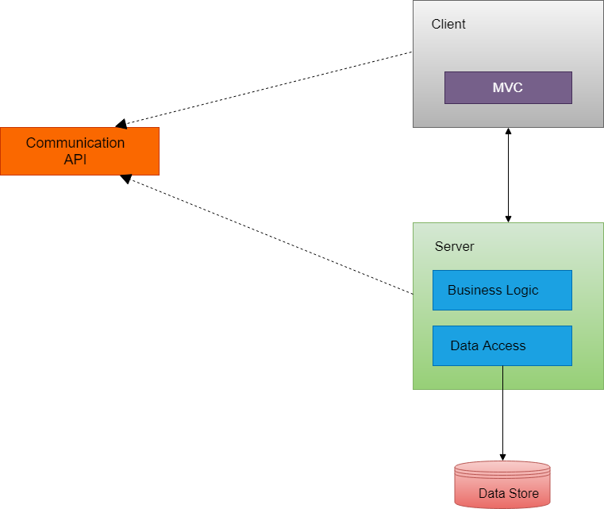

The client–server model of computing is a distributed computing structure that partitions tasks or workloads between the providers of a resource or service, called servers, and service requesters, called clients. Often clients and servers communicate over a computer network on separate hardware, but both client and server may reside in the same system. A server host runs one or more server programs which share their resources with clients. A client does not share any of its resources, but requests a server's content or service function. Clients therefore initiate communication sessions with servers which await incoming requests. Examples of computer applications that use the client–server model are Email, network printing, and the World Wide Web.

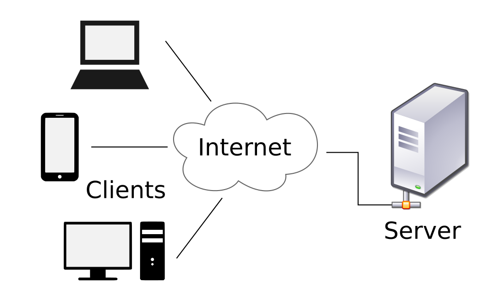

### Package Design
<!--[Create a package diagram]-->

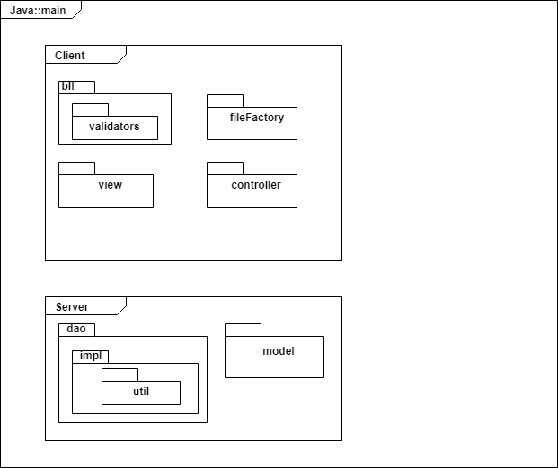

### Component and Deployment Diagrams
<!--[Create the component and deployment diagrams.]-->

Component diagram

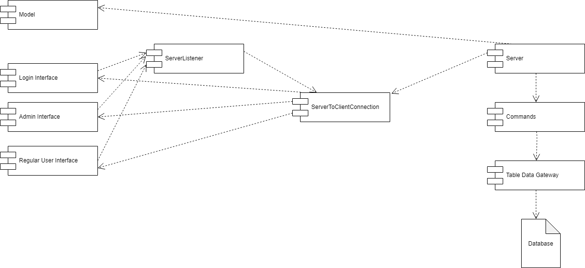

Deployment diagram

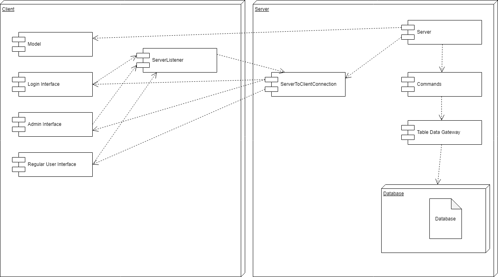

# Elaboration – Iteration 1.2

## Design Model

### Dynamic Behavior
<!--[Create the interaction diagrams (1 sequence, 1 communication diagrams) for 2 relevant scenarios]-->

Create Order - By Regular User

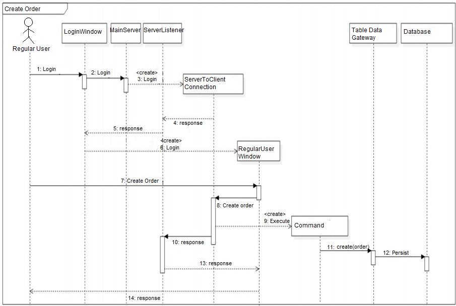

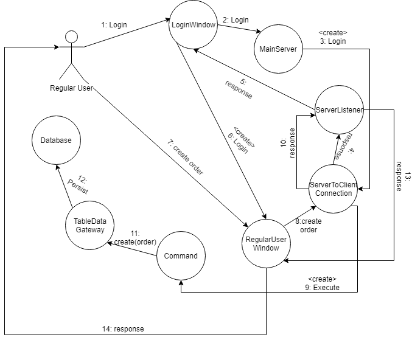

Edit Cookie - by Admin User

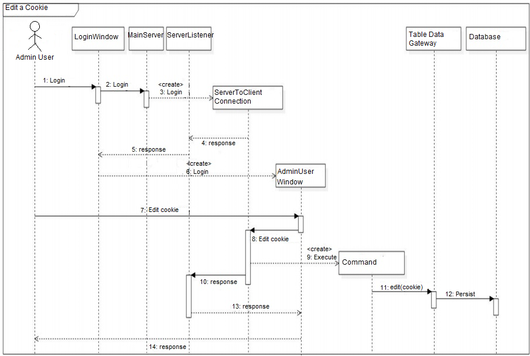

### Class Design
<!--[Create the UML class diagram; apply GoF patterns and motivate your choice]-->
Due to the high dimensions of the diagram and for a better visualization, the UML diagram will be divided in two parts - client and server:

1. The client 
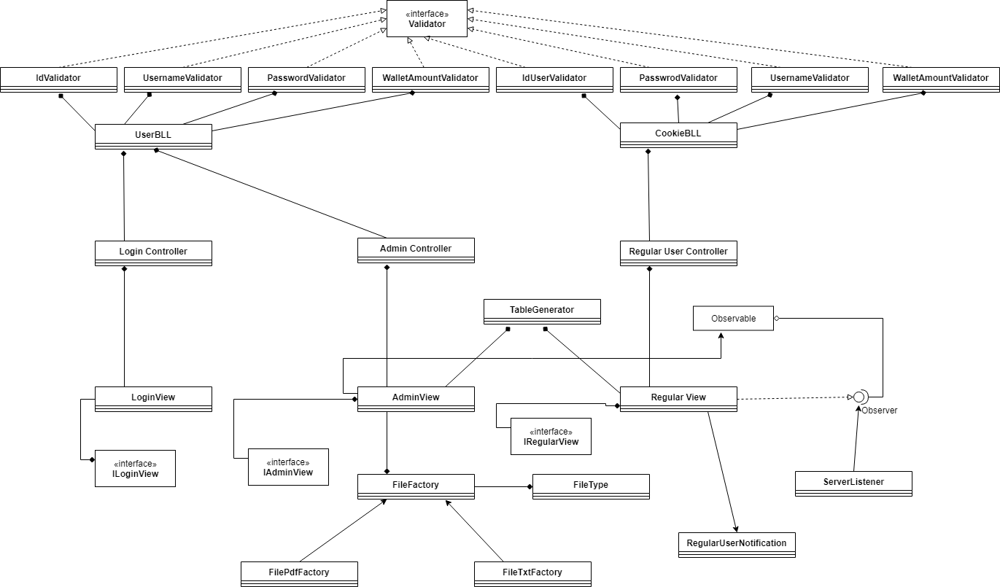

2. The server
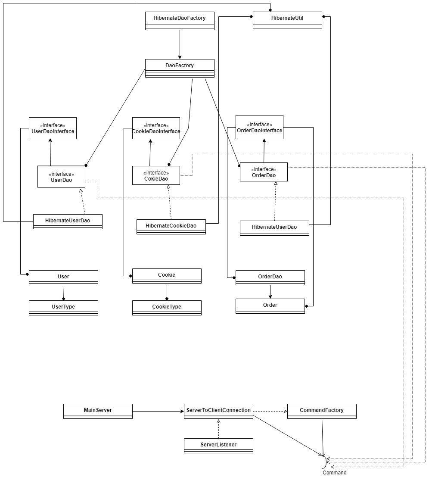

The following design patterns, parts of the "Gang of Four" patters are used in the project:
1. Factory Design Pattern
2. Observer Design Pattern
3. Command Design Pattern

- In order to generate the reports, such as selecting between the type of report to generate, the Factory Design Pattern, part of GoF patterns, is needed to be used.

About Factory Design Pattern:
 
In class-based programming, the factory method pattern is a creational pattern that uses factory methods to deal with the problem of creating objects without having to specify the exact class of the object that will be created. This is done by creating objects by calling a factory method—either specified in an interface and implemented by child classes, or implemented in a base class and optionally overridden by derived classes—rather than by calling a constructor.

- In order to notify the regular users when their favourite cookie is back on stock, the Observer Design Pattern, part of GoF patterns, is needed to be applied.

About Observer Design Pattern:
 
The observer pattern is a software design pattern in which an object, called the subject, maintains a list of its dependents, called observers, and notifies them automatically of any state changes, usually by calling one of their methods. It is mainly used to implement distributed event handling systems. The Observer pattern is also a key part in the familiar model–view–controller (MVC) architectural pattern. The observer pattern is implemented in numerous programming libraries and systems, including almost all GUI toolkits.

- In order to encapsulate all information needed to perform an action, the Command Design Pattern, part of GoF patterns, is needed to be applied.

About Command Design Pattern:
 
The command pattern is a behavioral design pattern in which an object is used to encapsulate all information needed to perform an action or trigger an event at a later time. This information includes the method name, the object that owns the method and values for the method parameters.
Four terms always associated with the command pattern are command, receiver, invoker and client. A command object knows about receiver and invokes a method of the receiver. Values for parameters of the receiver method are stored in the command. The receiver then does the work. An invoker object knows how to execute a command, and optionally does book-keeping about the command execution. The invoker does not know anything about a concrete command, it knows only about command interface. Both an invoker object and several command objects are held by a client object. The client decides which commands to execute at which points. To execute a command, it passes the command object to the invoker object.
Using command objects makes it easier to construct general components that need to delegate, sequence or execute method calls at a time of their choosing without the need to know the class of the method or the method parameters. Using an invoker object allows bookkeeping about command executions to be conveniently performed, as well as implementing different modes for commands, which are managed by the invoker object, without the need for the client to be aware of the existence of bookkeeping or modes.
 

### Data Model
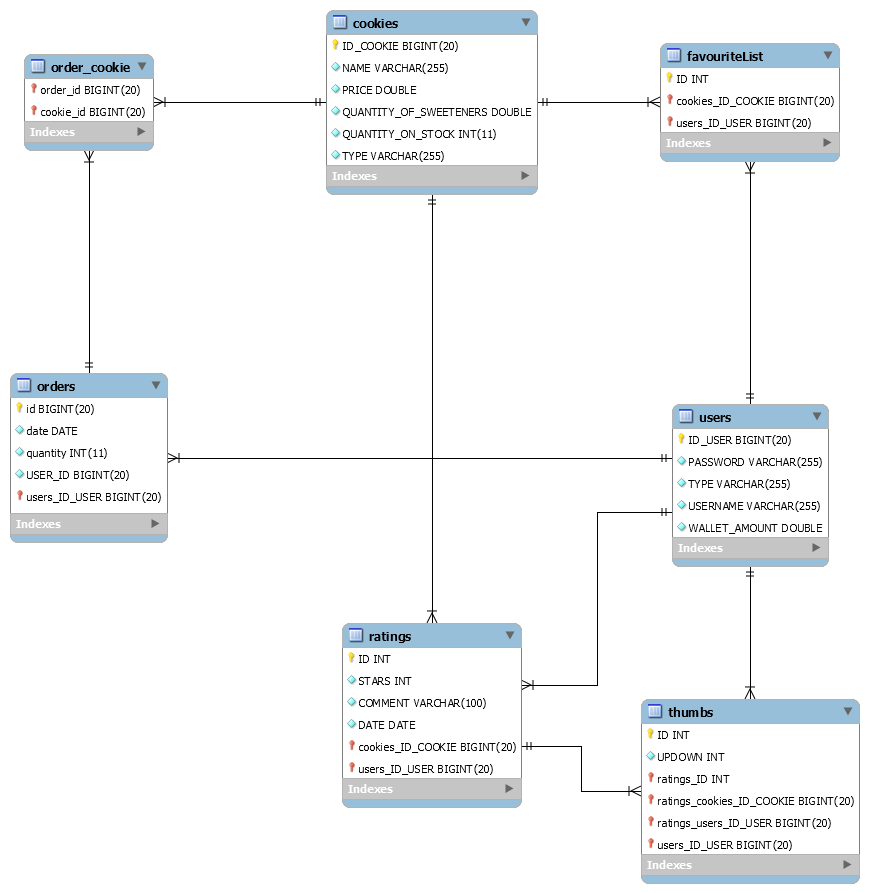

### Unit Testing
<!--[Present the used testing methods and the associated test case scenarios.]-->
Considering the unit testing, the Mockito framework was used in order to test the functionalities. Especially the table module part was tested. Moreover, the login and the CRUD parts are tested through the Mockito framework.
The CRUD can be considered as having different posibilities of being in the use cases.

# Elaboration – Iteration 2

## Architectural Design Refinement
<!--[Refine the architectural design: conceptual architecture, package design (consider package design principles), component and deployment diagrams. Motivate the changes that have been made.]-->
Conceptual Architecture

The conceptual architecture remains unchanged. It is good because it has all of the necessary modules: API, Client, Server and Data Source. At the end of this project, this remained the same.

Package Design 
However, the package design has changed because I started with client-server and on the development way I inserted the API module, so it changed a little more. The pachake design can be observed below:
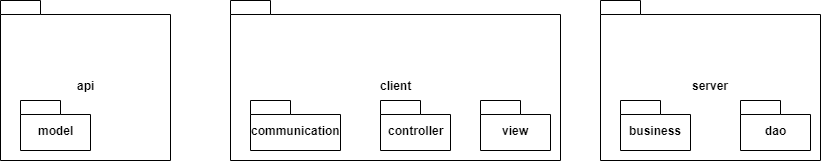

Component and Deployment Diagrams
They have changed also a little bit, because now I have another graphic user interface - Comment UI, and its controller. So, I inserted them in the diagrams below.

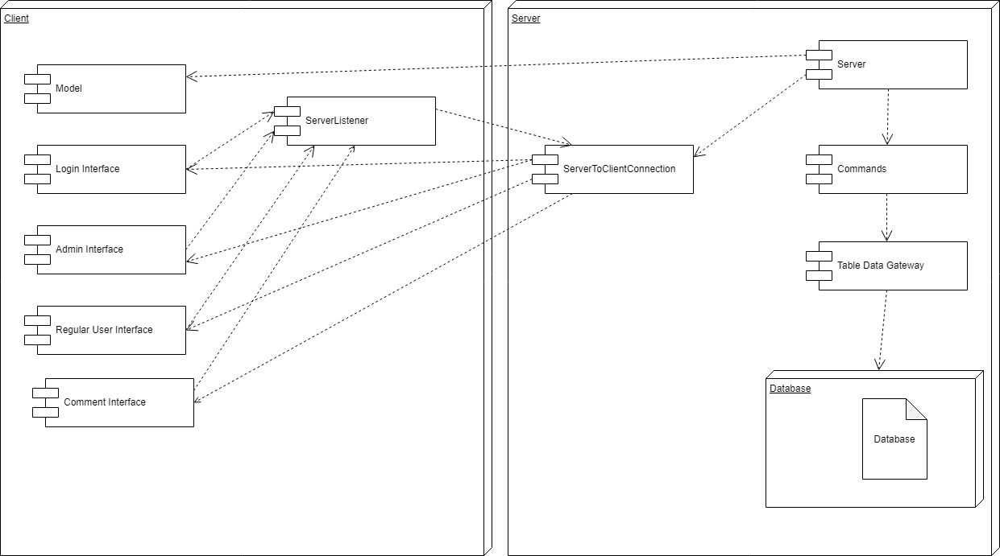

## Design Model Refinement
[Refine the UML class diagram by applying class design principles and GRASP; motivate your choices. Deliver the updated class diagrams.]
The UML Class Diagram has changed a little bit, because I had to change to database principles and also to separate the client and the server through the api module, which contains the models and the request.

The UML Diagram is separated in three parts in order to have a better visualization:

The API part:
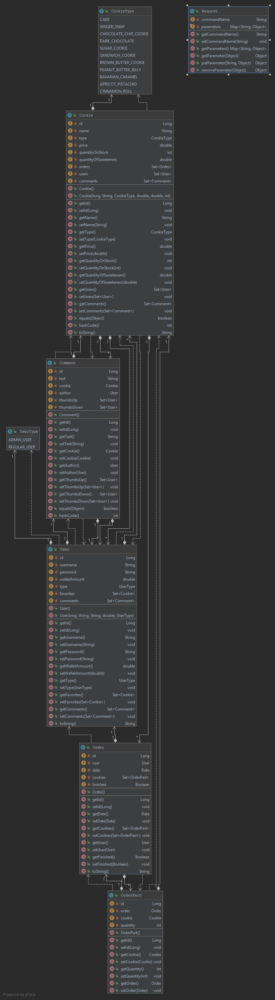

The CLIENT part:
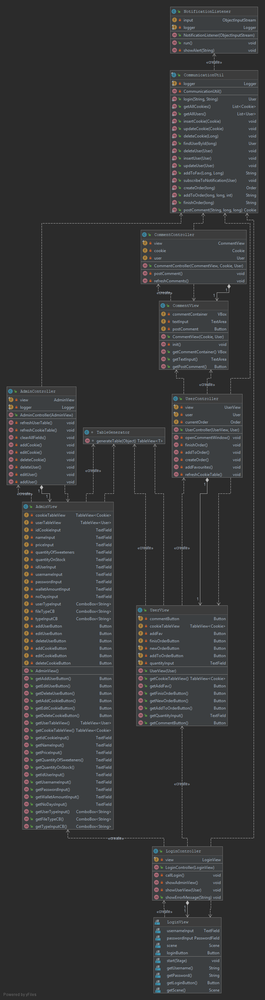

The SERVER part:
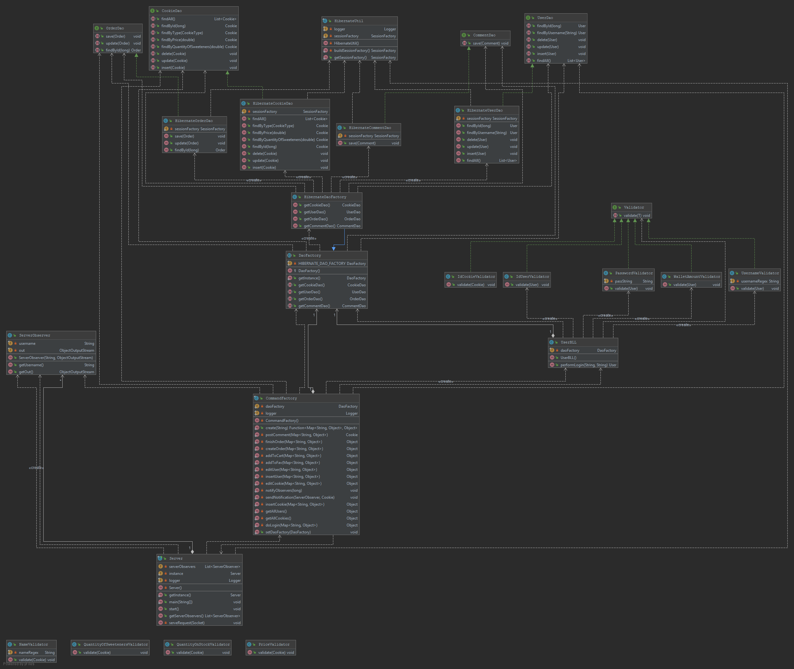

The data model has changed too, so there is the new one:
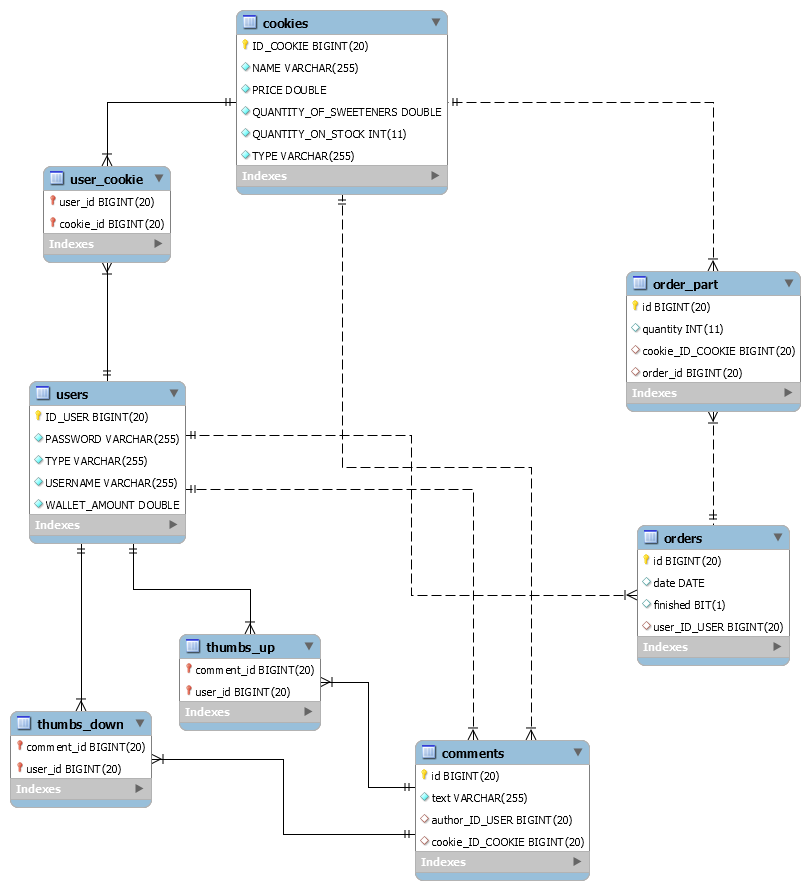

# Construction and Transition

## System Testing
<!--[Describe how you applied integration testing and present the associated test case scenarios.]-->
I applied the integration testing by doing tests on several classes using JUnit and Mockito.
I also verified some methods such as insert, edit, delete by checking them through the Graphical User Interfaace - Data-flow testing. 

## Future improvements
<!--[Present future improvements for the system]-->
As future improvements for the system I could say that improving the functionalities would be the first step (more filters, getting mails with the resume after buying cookies).
Moreover, the transition from the Desktop application to web or mobile would be nice. 

# Bibliography
- [Architectural Styles](https://docs.microsoft.com/en-us/azure/architecture/guide/architecture-styles/)
- [Architectural Patterns and Styles](https://msdn.microsoft.com/en-us/library/ee658117.aspx)
<!-- [Online diagram drawing software](https://yuml.me/) ([Samples](https://yuml.me/diagram/scruffy/class/samples-->
- [Yet another online diagram drawing software](https://www.draw.io)
