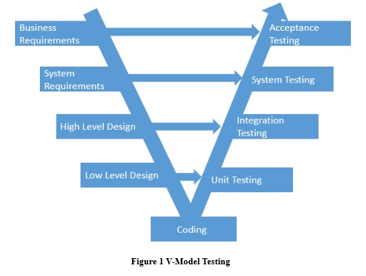

# Cookie Shop Supplementary Specification

# Introduction
The introduction of the Supplementary Specification provides an overview of the entire document.
The Supplementary Specification captures the system requirements that are not readily captured in the use cases of the use-case model. Such requirements include:
* Legal and regulatory requirements, including application standards.
* Quality attributes of the system to be built, including usability, reliability, performance, and supportability requirements.
* Other requirements such as operating systems and environments, compatibility requirements, and design constraints.

# Non-functional Requirements

The system quality attributes are defined in terms of scenarios according to the following template:
-	Quality attribute definition
-	Source of stimulus: the entity (human or another system) that generated the stimulus or event
-	Stimulus: a condition that determines a reaction of the system
-	Environment: the current condition of the system when the stimulus arrives
-	Artifact: is a component that reacts to the stimulus. It may be the whole system or some pieces of it
-	Response: the activity determined by the arrival of the stimulus
-	Response measure: the quantifiable indication of the response
-	Tactics

## Availability

The system is not expected to be used in urgent scenarios so we can afford a SLA of 99.5%. This translates into a yearly downtime of roughly 1 day and 19 hours, or a monthly downtime of 3 hours and 39 minutes. This time can be used to perform software updates, data compression and garbage collection. 

## Performance

Performance is not a key factor for our system. For this reason we can allow a response time of up to 30 seconds for request submissions in the worst case scenario. The average response time, depending on the load of the system, should be 1 second. 

## Security

The system will be secured using https encrypted connections. Also we will demand user authentication and will not keep passwords in plain text. Other user data will not be encrypted as we do not find it as being sensible information. 

## Testability

The business logic of the application must be tested independently from the user interface. We will employ V-Model testing as illustrated in Figure 1 V-Model Testing. It is aimed to have over 90% test coverage, through unit and integration tests. With respect to manual testing, the system will log all information that is not displayed in the user interface, so that the system is fully observable and testable. 

## Usability

The user should be able to reach any desired goal in under 30 mouse clicks. Moreover, since the city clerk works under stress, the system state will be displayed to him at all times and any terminal operation will prompt a confirmation dialog that describes the consequences of the action.

# Design Constraints

* Software languages: Java, JavaFX
* Software development process: Rational Unified Process (RUP), tailored to fit the project
* Software development tool: IntelliJ IDEA
* System contraint: at least Java 8 for the implementation
* Conceptual architecture of the system: client server as illustrated in the Figure 2 Conceptual Architecture below
* Libraries: JavaFX, Hibernate, JDBC, SQLite. 

# Resources

* Example of Supplementary Specification: http://csis.pace.edu/~marchese/SE616_New/Samples/Example%20%20Supplementary%20Specification.htm
