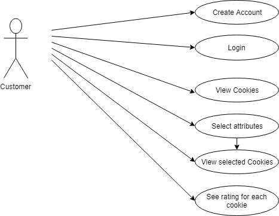
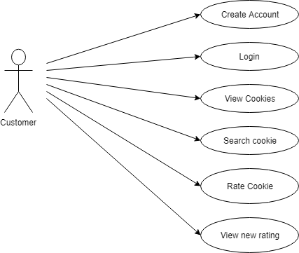
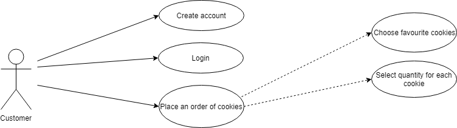

# Cookie Shop Use Case Model

# Use-Cases Identification
In the part below, the actors, the scenarios and the use cases will be identified, considering the most three important use-cases.

## View Cookies Use case
* **Use case**: View cookies
* **Level**: user-goal
* **Primary actor**: customer
* **Main success scenario**: 
1. The regular user(customer) opens the application.
2. The system prompts the user to log in.
3. The user clicks login
4. The system validates the user's data.
5. The system redirects the user to the home page.
6. The user clicks "View Cookies" button
7. The system opens the "View Cookies" page.
8. The user can choose to view cookies by selecting the convenient type, price and quantity of sweeteners.
9. The system displays the ordered cookies which are considered to the chosen attributes.
10. The user is now able to view their preferred cookies. 
 * **Extensions**: 
2'. In case of not having an account, the user must create an account, by writing their contact information, and by choosing a username and a password. 
9'. The system displays a message if none of the selected products exists. 
10'. The user can see each cookie's rating by clicking on it.

## Rate Cookies Use case
* **Use case**: Rate the cookies
* **Level**: user-goal
* **Primary actor**: customer
* **Main success scenario**:
1. The regular user(customer) opens the application.
2. The system prompts the user to log in.
3. The user clicks login
4. The system validates the user's data.
5. The system redirects the user to the home page.
6. The user clicks the "View Cookies" button
7. The system opens the "View Cookies" page.
8. The user searches the cookie they want to rate, by typing the name in the search field.
9. The system redirects the user to the selected cookie's part.
10. The user clicks on the cookie's part.
11. The system redirects the user to the rating part.
12. The user can add a rating constisted of 1 to 5 stars and they can also add a comment for it.
13. The user press the button "Submit rating".
14. The system place the rating below the cookie's information and also in the memory.
15. The system refreshes the page. 
* **Extensions**:  
2'. In case of not having an account, the user must create an account, by writing their contact information, and by choosing a username and a password. 
8'. If the user has not found their wanted cookie, the system displays an error message, thus the user should scroll the "View Cookie" page until they found it.  
14'. The system discards the data or does not have enough memory for the new rating.

## Order Cookies Use case
* **Use case**: Order Cookies
* **Level**: user-goal
* **Primary actor**: customer
* **Main success scenario**:
1. The regular user(customer) opens the application.
2. The system prompts the user to log in.
3. The user clicks login
4. The system validates the user's data.
5. The system redirects the user to the home page.
6. The user clicks the "Order Cookies" button.
7. The system redirects the user to the "Order Cookies" page.
8. The user double clicks on the cookies they want to add to the shopping cart.
9. The system adds the selected cookies to the shopping cart section. 
10. Once the user is done selecting, they must click on the "Shopping Cart" button.
11. The system redirects the user to the "Shooping Cart" page.
12. The user types the quantity for each cookie in the field named "Quantity" attached to each one. 
13. The user clicks the "Place an order" button.
14. The system add the ordered list in the memory and in the user's history.
* **Extensions**: 
2'. In case of not having an account, the user must create an account, by writing their contact information, and by choosing a username and a password. 
8'. If the selected cookies are not on stock, the system will display a warning message. 
14'. The system might not have enough memory for the new order.

<!--## Use case 4
* **Use case**: use case goal
* **Level**: one of: summary level, user-goal level, sub-function
* **Primary actor**: a role name for the actor who initiates the use case>
* **Main success scenario**: the steps of the main success scenario from trigger to goal delivery
* **Extensions**: alternate scenarios of success or failure-->

# UML Use-Case Diagrams

## Diagram 1

## Diagram 2

## Diagram 3

<!--## Diagram 4
-->

# Bibliography

<!--* [Online diagram drawing software](https://yuml.me/) ([Samples](https://yuml.me/diagram/nofunky/usecase/samples))-->
* [Diagram drawing software](https://www.draw.io)
